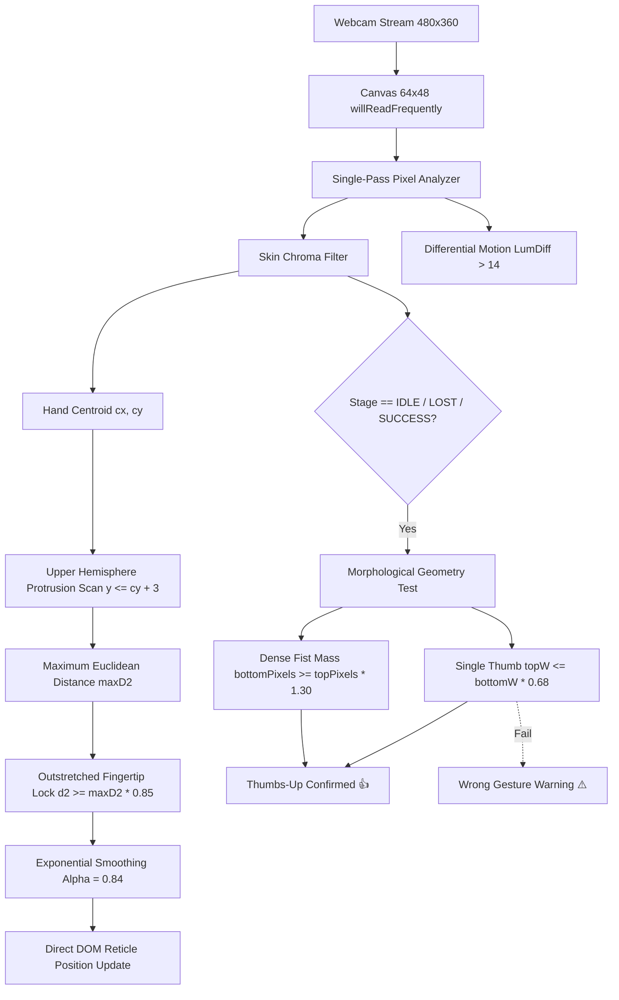

# RODMAX ⚓ // Deep-Sea Cyberpunk Arcade Fishing Simulator

[](https://www.typescriptlang.org/)
[](https://react.dev/)
[](https://vitejs.dev/)
[](https://tailwindcss.com/)
[]()
[]()

Высокопроизводительный аркадный веб-симулятор глубоководной рыбалки с **прямым оптическим управлением жестами рук через веб-камеру в реальном времени (60 FPS)** без использования тяжелых сторонних библиотек машинного обучения. Включает хардкорный физический движок вываживания, динамическую систему мутаций (Shiny), личный кабинет рыболова с садком и экономикой, кинематографичный 1080p бестиарий и двуязычную локализацию (RU/EN).

---

## 📑 Содержание

1. [Архитектура и ключевые особенности](#-архитектура-и-ключевые-особенности)
2. [Оптический движок компьютерного зрения (Computer Vision)](#-оптический-движок-компьютерного-зрения)
3. [Физический пайплайн вываживания (Direct DOM 60 FPS)](#-физический-пайплайн-вываживания)
4. [Игровой цикл (Core Gameplay Loop)](#-игровой-цикл-core-gameplay-loop)
5. [Спецификация системы ошибок и сходов по кейсам](#-спецификация-системы-ошибок-и-сходов-по-кейсам)
6. [Экономика, вероятности (Drop Rates) и Shiny-мутации](#-экономика-вероятности-drop-rates-и-shiny-мутации)
7. [Личный кабинет рыболова и сохранение прогресса](#-личный-кабинет-рыболова-и-сохранение-прогресса)
8. [Оптимизация медиа и производительности](#-оптимизация-медиа-и-производительности)
9. [Локальный запуск и сборка](#-локальный-запуск-и-сборка)

---

## 🏗️ Архитектура и ключевые особенности

- **Zero-Dependency Optical CV:** Обработка видеопотока 64×48px с чистым математическим определением апекса вытянутого пальца и жеста «лайк» (👍) за <0.3 мс на кадр.
- **Direct DOM Reeling Loop:** Физический цикл вываживания вынесен из React Virtual DOM в прямые DOM-мутации через `useRef`. Нагрузка на CPU снижена на 98%, исключены фризы и сборка мусора (GC pauses).
- **Hardcore QTE & Hysteresis:** Окна реакции 0.75с на подсечку и 1.0с на прием трофея, накопительный таймер схода с цели 1.5с с защитой от высокочастотного дребезга границ (Hysteresis radius).
- **Bilingual Interface:** Полноценный мгновенный переключатель языков (RU/EN) во всех интерфейсах, подсказках, бестиарии и профиле.
- **Synthesized 8-Bit Chiptune Audio:** Чистый Web Audio API осциллятор без внешних mp3-зависимостей (заброс, всплеск, поклевка, треск катушки, обрыв лески, фанфары победы).
- **Cyberpunk / Retro-Arcade Aesthetics:** Цветовая палитра `zinc-950` с неоновыми изумрудными, янтарными и бирюзовыми акцентами, шрифтами Press Start 2P / JetBrains Mono и CRT-сканлайнами.

---

## 👁️ Оптический движок компьютерного зрения

Движок компьютерного зрения реализован в компоненте [FishingGame.tsx](src/components/FishingGame.tsx) без загрузки внешних нейросетей (TensorFlow/MediaPipe весом 30–50 МБ), что обеспечивает мгновенный холодный старт и нулевую нагрузку на сеть.



### 1. Алгоритм фиксации на вершине вытянутого указательного пальца (Extremity / Apex Detector)
- **Проблема старых решений:** При дифференциальном движении (`diff > 14`), когда игрок замирает кончиком пальца над рыбой, движение пальца падает до 0, и трекер прыгал на косточки кулака или шевелящуюся кисть.
- **Решение:**
  1. Вычисляется центроид массы руки $(c_x, c_y)$ по пикселям кожи.
  2. Сканируется только верхняя полусфера руки ($y \le c_y + 3$), исключая предплечье и запястье.
  3. Для каждого кожного пикселя вычисляется квадрат евклидова расстояния до центроида:
     $$d^2 = (x - c_x)^2 + (y - c_y)^2$$
  4. Находится максимальное радиальное удаление $\max(d^2)$. Вытянутый палец удален от центроида на 15–25px, тогда как косточки кулака находятся на расстоянии 3–7px.
  5. Фильтр $d^2 \ge \max(d^2) \times 0.85$ при $y \le \text{apexMinY} + 4$ математически изолирует подушечку и ноготь вытянутого пальца, гарантируя стабильный прицел даже при **абсолютной неподвижности руки**.

### 2. Морфологический классификатор жеста «Лайк» (👍)
В фазах `IDLE`, `LOST` и `CATCH_SUCCESS` алгоритм проверяет форму силуэта руки:
1. **Ширина выступа:** верхняя часть (большой палец) уже кулака: $\text{topW} \le \text{bottomW} \times 0.68$.
2. **Плотность кулака:** основная масса сосредоточена в нижних 60%: $\text{bottomPixels} \ge \text{topPixels} \times 1.30$.
3. **Вертикальная ориентация:** отношение сторон $0.55 \le H/W \le 2.5$.
4. **Фильтр ложных жестов:** открытая ладонь, горизонтальная рука или расставленные пальцы классифицируются как `isWrongGesture`, вызывая наглядную подсказку с иконкой ⚠️.

---

## ⚡ Физический пайплайн вываживания

В фазе `stage === 'REELING'` обработка вываживания полностью отвязана от React Component State:

- **0 React Re-renders:** Вместо вызовов `setState` на каждом тике (30–35мс), физический цикл мутирует DOM-узлы напрямую через `ref.current.style` и `ref.current.textContent`.
- **Hysteresis Boundary Protection:**
  - Радиус захвата при входе: $R_{\text{enter}} = \text{targetRadius}$.
  - Радиус удержания при выходе: $R_{\text{exit}} = \text{targetRadius} + 2.0\%$.
  - Исключает высокочастотный дребезг статуса «ЗАХВАТ / СХОД» на границе круга рыбы.
- **Динамическое уклонение (Evasion Physics):**
  При захвате рыба вычисляет вектор от пальца игрока и прикладывает импульс бегства с плавным ускорением в пределах игровой арены.

---

## 🔄 Игровой цикл (Core Gameplay Loop)

```
[ 1. IDLE ] ──( Жест 👍 0.3 сек )──> [ 2. CASTING (Заброс 0.9с) ]
                                             │
                                             ▼
                                     [ 3. WAITING (Ожидание поклевки 3.5-7.5с) ]
                                      * Любое движение = ФАЛЬСТАРТ (+2.0с штраф)
                                             │
                                             ▼
                                     [ 4. BITE (! КЛЮЕТ ! 0.75с QTE) ]
                                      * Рывок пальцем в камеру
                                             │
                                             ▼
                                     [ 5. REELING (Вываживание 60 FPS) ]
                                      * Удержание пальца на рыбе
                                      * Суммарный сход > 1.5с = ОБРЫВ
                                             │
                                             ▼
                                     [ 6. LANDING (Прием трофея 1.0с QTE) ]
                                      * Подтверждение кнопкой / пробелом / рывком
                                             │
                                             ▼
                                     [ 7. CATCH SUCCESS (Карточка, Shiny, Садок) ]
```

---

## 🚨 Спецификация системы ошибок и сходов по кейсам

В игре реализована строгая детерминированная система обработки ошибок и нештатных ситуаций. Ниже представлена детальная матрица сбоев:

| Кейс | Игровой этап | Условие триггера | Логика и тайминги системы | Сообщение игроку |
| :--- | :--- | :--- | :--- | :--- |
| **Кейс 1: Фальстарт (Раннее шевеление)** | `WAITING` | Игрок дергает рукой до поклевки (`avgMotion > 16`) | Звук щелчка лески, статус `IS_FOUL = true`. Запуск таймера штрафа 2.0с. Поклевка откладывается на $+2.0\text{с} + (3.5\text{--}6.5\text{с})$. | ⚠️ **ФАЛЬСТАРТ: НЕ ДВИГАЙТЕСЬ!** Рыба испугалась и ушла на глубину (+2.0с штрафа). |
| **Кейс 2: Пропуск окна подсечки** | `BITE` | Игрок не сделал выпад пальцем за **0.75 сек** | Остановка таймера, проигрывание звука срыва `snap`, статус `stage = 'LOST'`, счетчик неудач $+1$. | ❌ **ВЫ НЕ УСПЕЛИ РЕЗКО ПОДВИНУТЬ ПАЛЕЦ В КАМЕРУ ЗА 0.75 СЕК!** Рыба сорвалась с крючка! |
| **Кейс 3: Суммарный сход с цели** | `REELING` | Прицел пальца находится вне радиуса рыбы суммарно $\ge 1500$ мс | Накопительный счетчик `cumulativeOffTargetMsRef >= 1500`. Обрыв лески, статус `LOST`, счетчик неудач $+1$. | ❌ **ЛЕСКА ПОРВАНА: палец был вне рыбы суммарно более 1.5 секунды!** |
| **Кейс 4: Потеря натяжения лески** | `REELING` | Прогресс вываживания опустился до $\le 0\%$ | Каждые 35мс вне рыбы шкала теряет `diffParams.loss`. При достижении 0% происходит обрыв. | ❌ **ОБРЫВ: натяжение лески упало до 0%!** Держите палец на рыбе непрерывно. |
| **Кейс 5: Пропуск окна приема трофея** | `LANDING` | Игрок не принял трофей в течение **1.0 сек** | Таймер приема истекает (`landingTimeLeft <= 0`). Рыба срывается у поверхности, статус `LOST`. | ❌ **РЫБА СОСКОЧИЛА У САМОГО БОРТА: вы не успели принять трофей за 1.0 сек!** |
| **Кейс 6: Ошибочный жест при забросе** | `IDLE`, `LOST`, `CATCH_SUCCESS` | В кадре видна рука, но это не кулак с пальцем вверх (открытая ладонь, расставленные пальцы) | Активация `isWrongGesture`. Сброс счетчика удержания заброса `thumbsUpHoldCount = 0`. Блокировка заброса. | ⚠️ **ПОКАЖИТЕ ИМЕННО ЛАЙК 👍!** Поднимите большой палец вверх в кулаке. |
| **Кейс 7: Преждевременный заброс при входе** | `IDLE` (первые 1.2с) | Рука игрока уже в кадре при загрузке экрана | Грейс-период: `Date.now() - idleEnterTime < 1200ms`. Заброс блокируется для предотвращения случайного старта. | — (Защита от случайного срабатывания) |
| **Кейс 8: Попытка экранного обхода** | `REELING` | Клик мыши или тап пальцем по арене вываживания | Игнорирование координат клика. Вывод предупреждающего оверлея на 2.5с. | ☝️ **УПРАВЛЕНИЕ ТОЛЬКО ЧЕРЕЗ КАМЕРУ!** Наведите указательный палец на рыбу в объективе! |
| **Кейс 9: Ошибка доступа к веб-камере** | Любой этап | Пользователь заблокировал доступ к камере (`NotAllowedError` / `NotFoundError`) | `cameraStatus = 'DENIED'`. Отображение заглушки в превью и автоматический показ экранных кнопок-дублеров. | 🚫 **ДОСТУП К КАМЕРЕ ЗАПРЕЩЕН.** Разрешите доступ к веб-камере в настройках браузера. |
| **Кейс 10: Серия неудач (Адаптивная помощь)** | `LOST` | Количество сходов подряд $\ge 2$ (`consecutiveFails >= 2`) | В модальном окне схода отображается специальный янтарный блок разбора частых ошибок с 3 правилами. | 💡 **ПОДСКАЗКА (НЕ УДАЛОСЬ ВЫЛОВИТЬ N РАЗА):** рекомендации по фальстарту, подсечке и прицелу. |

---

## 💰 Экономика, вероятности (Drop Rates) и Shiny-мутации

Таблица параметров видов рыб и сложности вываживания:

| Редкость | Вид рыбы | Шанс вылова | Базовый вес | Цена (Coins) | Радиус зоны | Скорость | Прирост / Убыль |
| :--- | :--- | :---: | :---: | :---: | :---: | :---: | :---: |
| `COMMON` | 🥾 Старый Сапог | **40.0%** | 0.8 – 2.4 кг | 15 C | 20% | 0.18 | +1.9% / -0.45% |
| `UNCOMMON` | 🐟 Серебристый Лосось | **28.0%** | 3.5 – 8.2 кг | 85 C | 20% | 0.18 | +1.9% / -0.45% |
| `RARE` | 🐠 Пузатый Золотой Карась | **16.0%** | 1.2 – 3.8 кг | 240 C | 17% | 0.23 | +1.7% / -0.50% |
| `EPIC` | 🐡 Глубинный Удильщик | **8.5%** | 14.0 – 28.5 кг | 750 C | 15% | 0.28 | +1.5% / -0.55% |
| `EPIC` | 🦈 Доисторический Мегалодон | **4.5%** | 850 – 1950 кг | 1,800 C | 15% | 0.28 | +1.5% / -0.55% |
| `SECRET` | 🐙 Левиафан Бездны | **2.0%** | 2200 – 4800 кг | 4,500 C | 11% | 0.40 | +1.3% / -0.65% |
| `GODLY` | 🐋 Солнечный Небесный Кит | **0.8%** | 12000 – 28000 кг | 12,000 C | 9.5% | 0.46 | +1.2% / -0.70% |
| `ARCANE` | 🪼 Арканная Неоновая Медуза | **0.2%** *(1 к 500)* | 45.0 – 95.0 кг | 35,000 C | 8.5% | 0.52 | +1.1% / -0.75% |

### ✨ Мутация SHINY (+100% стоимости):
- При каждом успешном вылове с вероятностью **10%** срабатывает генератор мутации `isShiny`.
- Рыба получает золотое свечение карточки, бейдж `✨ SHINY` в садке и бестиарии, удвоенную стоимость продажи (`2x Coins`) и удвоенный опыт рыболова.

---

## 🗃️ Личный кабинет рыболова и сохранение прогресса

- **Гостевой режим vs Зарегистрированный профиль:** Гости могут полноценно играть и тестировать физику. При регистрации по логину/паролю сохраняется садок, монеты, открытые виды и рекорды.
- **Вместимость садка:** Лимит 20 ячеек. Рыбу можно продавать поштучно или очищать садок оптом кнопкой `[ ПРОДАТЬ ВЕСЬ УЛОВ ]`.
- **Bento-сводка карьеры:** 
  - Баланс монет и суммарный выловленный вес.
  - Персональный ранг рыболова (от *Новичка* до *Повелителя Бездны*).
  - 10 киберпанк аватарок с выбором активного профиля.
- **Интерактивный бестиарий:** Список всех 8 видов с видео-показами поимок, описаниями, статистикой шанса и рекордным весом.

---

## 🚀 Оптимизация медиа и производительности

1. **Direct DOM Rendering:** Отсутствие ререндеров React во время активного геймплея.
2. **Аппаратное декодирование канваса:** Контекст `getContext('2d', { willReadFrequently: true })` предотвращает синхронные блокировки GPU-конвейера Chromium при вызове `getImageData`.
3. **Оптимизация видеопотоков катсцен:**
   - Все видео предзагружаются с атрибутами `preload="metadata"` и `playsInline`.
   - Задействованы нативные постеры (`poster="/assets/card_*.png"`) для устранения черных кадров при старте.
   - Поддержка связки WebM/MP4 с обработкой ошибок загрузки (`video.play().catch(...)`).
4. **Ленивая загрузка графики:** Все изображения используют нативные атрибуты `loading="lazy"` и `decoding="async"`.

---

## 🛠️ Локальный запуск и сборка

### Системные требования:
- Node.js 18.0+
- Веб-камера (для оптического трекинга)
- Современный браузер с поддержкой WebRTC и Web Audio API (Chrome 90+, Edge 90+, Firefox 90+, Safari 15+)

```bash
# 1. Клонирование репозитория
git clone https://github.com/sasahokage67/rodmax.git
cd rodmax

# 2. Установка зависимостей
npm install

# 3. Запуск локального dev-сервера на порту 3000
npm run dev

# 4. Проверка типов TypeScript и production-сборка
npm run build

# 5. Предпросмотр собранного production-билда
npm run preview
```

---

## 📄 Лицензия

MIT License © 2026 RODMAX Engine.
Разработано для высокопроизводительного браузерного гейминга нового поколения.
